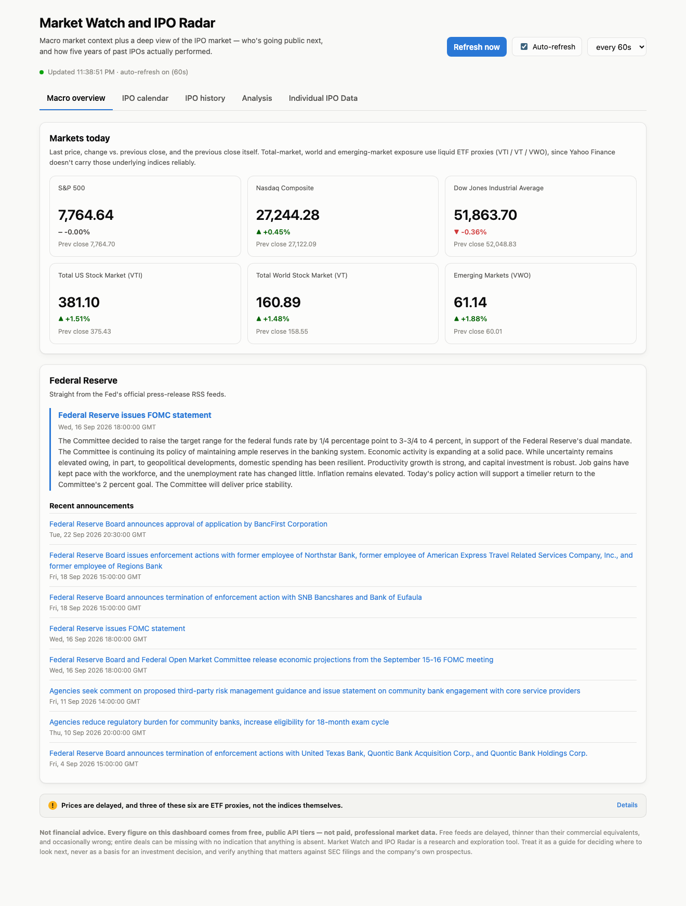
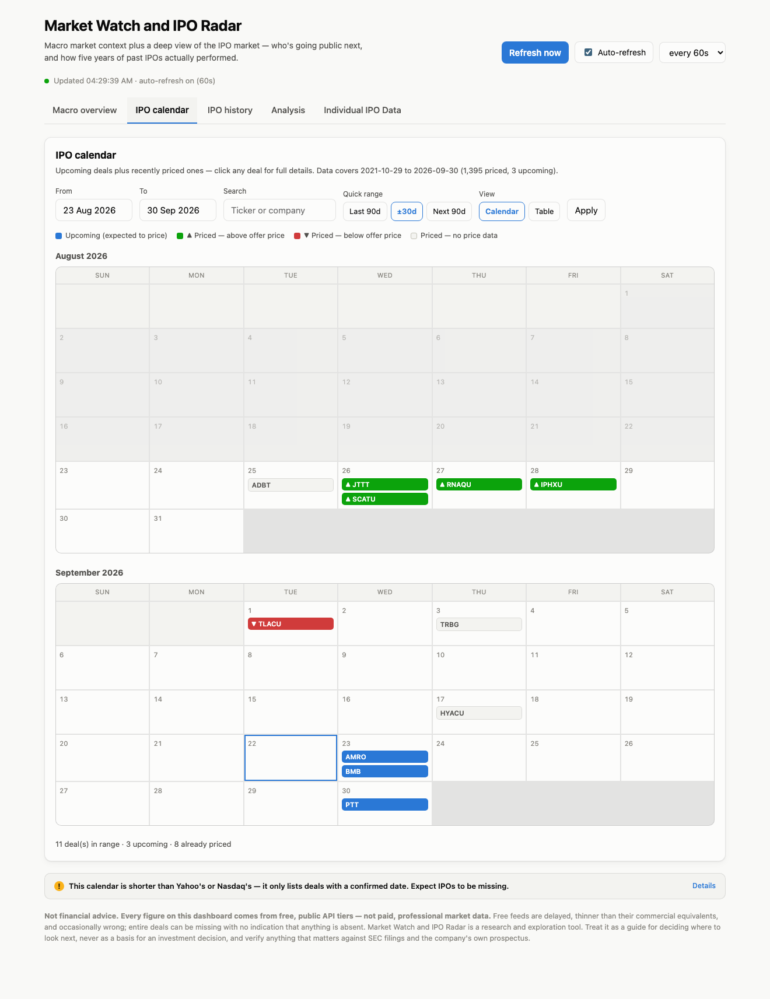
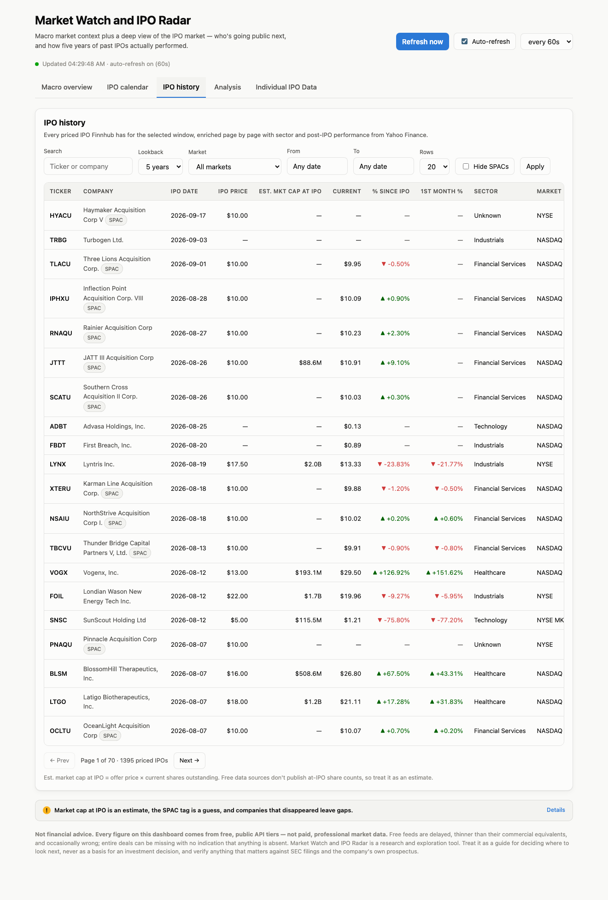
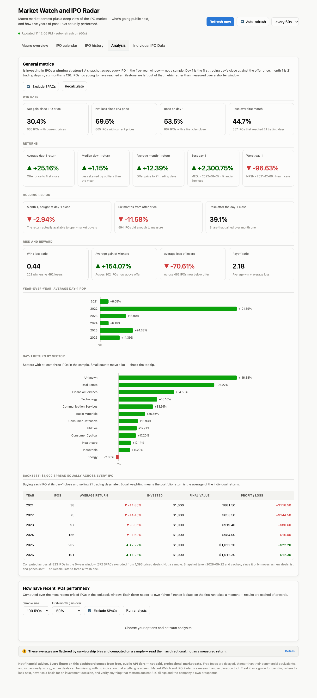
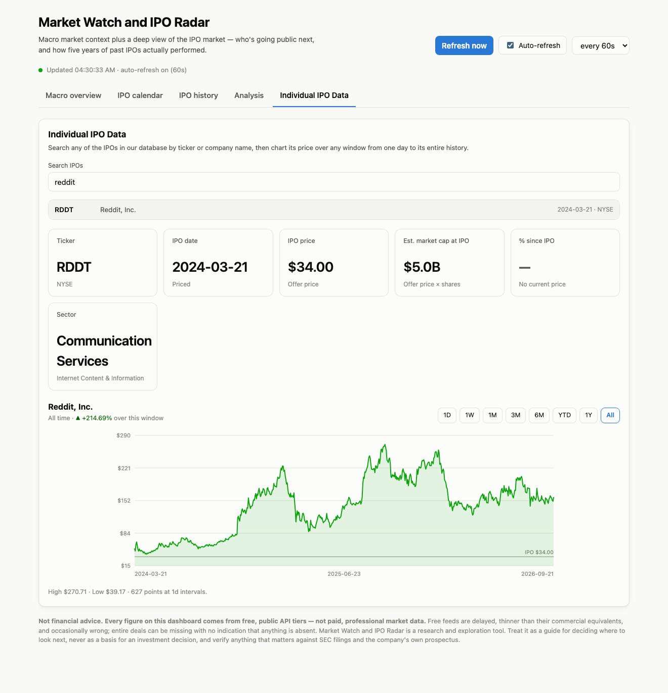

# Market Watch and IPO Radar

An IPO-focused market dashboard. Most stock apps tell you what the market did today; this one
answers a harder question: **who is going public next, and did going public actually work out for
the companies that did it?**



| | |
|---|---|
|  |  |
| **IPO calendar** — upcoming and recently priced deals, coloured by whether they trade above or below their offer price | **IPO history** — five years of priced IPOs with sector and post-IPO performance |
|  |  |
| **Analysis** — win rates, returns, holding periods and an equal-weight backtest | **Individual IPO data** — search any deal and chart it over eight timeframes |

## What it does

**Macro overview** — live prices, daily % change and previous close for the S&P 500, Nasdaq
Composite, Dow Jones, plus total-US, total-world and emerging-market exposure. Underneath, the
most recent FOMC statement (the actual statement text, not just the headline) and the Fed's
latest press releases.

**IPO calendar** — upcoming deals alongside recently priced ones, as a month grid or a table,
filterable to any date range the data actually covers. Click any deal for a detail panel with its
ticker, sector, industry, exchange, offer terms and post-IPO performance.

A note on why the calendar shows past deals too: Finnhub typically has only a *handful* of
confirmed upcoming IPOs at any moment — three, the day this was built, none more than eight days
out. A future-only calendar is therefore almost always empty. Including recently priced deals (65
in the last 90 days) makes it an actual calendar. The two are colour-coded and counted separately.

The date pickers are bounded to the real coverage window, queried from `/api/ipo/coverage` at
load, so you can't ask for 1990 or next year and get a blank grid.

**IPO history** — roughly 1,400 priced IPOs over the last five years. Each row carries ticker,
company, IPO date, offer price, estimated market cap at IPO, current price, % change since IPO,
first-month % change, sector and listing market. Filterable by market, date range, and SPAC status.

**Analysis** — two parts. *General metrics* is a snapshot across the **whole dataset** rather than a
sample of it (all 823 non-SPAC deals Finnhub lists for the window — which is not every IPO that
happened; see the coverage caveat above): win rates, day-1 / month-1 / six-month returns, holding-period
analysis, sector and year-over-year breakdowns, and an equal-weight backtest. Because that means
several hundred price lookups, the finished snapshot is cached and recomputed periodically. Below
it, a sampled breakdown of the most recent N IPOs by sector, with every deal in the sample listed.

## Why the SPAC filter exists

The single most surprising thing I found building this: **SPACs (blank-check shells) are the
majority of the IPO calendar** — 572 of 1,395 listings in the five-year window. They all price at
exactly $10.00, have no operating business, and therefore no sector and essentially no price
movement. Left in, they drag every sector average toward zero and make the data look far more
boring than it is. The dashboard flags them heuristically (name contains "Acquisition Corp" /
"blank check", or a $10.00 offer with a `U`/`W` suffix ticker) and lets you filter them out.
The Analysis tab excludes them by default.

## Data sources

| Source | Used for | Key needed |
|---|---|---|
| [Finnhub](https://finnhub.io) `/calendar/ipo` | Upcoming + historical IPO deals | Yes (free) |
| [yfinance](https://github.com/ranaroussi/yfinance) (Yahoo Finance) | Index prices, post-IPO performance, sectors | No |
| [Federal Reserve RSS](https://www.federalreserve.gov/feeds/) | FOMC statement + press releases | No |

### How the API is called

The IPO data comes from Finnhub's REST API, called with Python's **`requests`** module: a plain
`GET` to `https://finnhub.io/api/v1/calendar/ipo` with three query parameters — `from` and `to` as
`YYYY-MM-DD` dates, plus `token`, the API key read from the environment. It answers with JSON: an
object holding an `ipoCalendar` list, where each deal is a dictionary of strings and numbers
(`symbol`, `name`, `date`, `exchange`, `status`, `numberOfShares`, and `price`, which is a string
that may be a single figure or a `"18.00-20.00"` range and so has to be parsed). Because Finnhub's
free tier caps the date span per call, five years of history is fetched as a series of 90-day
windows and stitched together. Two further sources fill in what Finnhub does not provide: the
**`yfinance`** wrapper returns prices as pandas DataFrames (used for index quotes, post-IPO
performance and the charts), and **`feedparser`** reads the Federal Reserve's RSS feeds for the
FOMC statement and recent announcements.

### Two honest caveats

- **Index proxies.** Yahoo Finance doesn't reliably carry the Wilshire 5000 or MSCI World
  indices, so total-US / total-world / emerging-market exposure uses the VTI, VT and VWO ETFs
  instead. They track those markets closely, but they are funds, not the indices themselves.
- **"Est. market cap at IPO"** is the offer price × the company's *current* shares outstanding.
  No free data source publishes at-IPO share counts, so this over- or under-states the real
  figure whenever a company has issued or bought back stock since listing. It is labelled as an
  estimate everywhere it appears.

## Running it

Requires Python 3.9+.

```bash
git clone https://github.com/dcerrato-create/Personal-Website-Portfolio.git
cd Personal-Website-Portfolio/market-watch-ipo-radar

python3 -m venv venv
source venv/bin/activate          # Windows: venv\Scripts\activate
pip install -r requirements.txt

cp .env.example .env              # then paste your free Finnhub key into .env
python app.py
```

Open **http://127.0.0.1:5000**.

Get a free Finnhub key at [finnhub.io/register](https://finnhub.io/register) — no credit card.
The key lives in `.env`, which is gitignored, and every API call happens server-side, so the key
is never exposed to the browser.

The macro tab works without a key; only the IPO tabs need Finnhub.

## How it's put together

```
app.py                 Flask routes + JSON API
services/
  indices.py           yfinance index snapshots
  fed.py               Fed RSS feeds + press-release text extraction
  ipo.py               Finnhub IPO calendar + yfinance enrichment + stats
  cache.py             File-based TTL cache
static/
  index.html           Single-page UI
  app.js               Fetch, render, refresh, the sector chart
  style.css            Light + dark theming
```

### API

| Route | Returns |
|---|---|
| `GET /api/indices` | Index snapshot |
| `GET /api/fed` | Latest FOMC statement + recent announcements |
| `GET /api/ipo/upcoming?days=&start=&end=` | Upcoming deals only |
| `GET /api/ipo/calendar?start=&end=` | Priced + upcoming deals merged for the calendar |
| `GET /api/ipo/coverage` | Real earliest/latest dates available, for bounding the date pickers |
| `GET /api/ipo/detail?symbol=&date=` | One deal, enriched on demand for the detail panel |
| `GET /api/ipo/history?years=&exchange=&page=&q=&exclude_spacs=` | Paginated priced IPOs |
| `GET /api/ipo/search?q=` | Every IPO we hold, matched by ticker or company name |
| `GET /api/ipo/chart?symbol=&range=&date=` | Price series (`1d`/`1w`/`1m`/`3m`/`6m`/`ytd`/`1y`/`max`) |
| `GET /api/ipo/stats?years=&sample=&threshold=` | Sector performance, first-month gainers, full sample |
| `GET /api/ipo/general?years=&per_year=&exclude_spacs=` | Win rates, returns, holding periods, backtest |
| `GET /api/health` | Status + whether a key is configured |
| `POST /api/cache/clear` | Empties the on-disk cache (local utility) |

Add `?refresh=true` to any GET to bypass the cache.

### Performance notes

Two things make this usable rather than painfully slow:

- **Caching.** Every upstream response is cached to disk with a TTL suited to how fast it
  changes — 60s for index prices, 15 min for upcoming IPOs, 12 h for historical deals, 6 h for
  per-ticker enrichment. Pulling five years of IPOs takes ~30s once, then is instant.
- **Threading.** Each IPO needs its own Yahoo Finance lookup (~2-4s). Enriching a 100-IPO sample
  serially would take minutes, so lookups run in an 8-thread pool and come back in a few seconds.

### Failure handling

The dashboard is built to degrade rather than break:

- A missing or rejected API key returns a structured error the UI explains in plain language.
- If one date chunk of a multi-request history fetch fails, the rest still load and the UI shows
  a "partial data" banner.
- If an upstream call fails but stale cache exists, the stale copy is served rather than blanking
  the screen.
- Dead, delisted or not-yet-trading tickers resolve to "—" instead of crashing the row.
- Non-finite floats (`NaN` from pandas) are converted to `null` — Python's JSON writer emits bare
  `NaN`, which browsers refuse to parse, so this silently broke the whole history table until it
  was fixed.
- **Failures are never cached.** Yahoo Finance rate limits under heavy use, and a rate-limited
  response *looks* like a successful fetch that found nothing. Since profiles cache for a week,
  writing one would have shown those companies as having no data for seven days. Results that
  represent an error are now discarded, and the previous good value is served instead. A genuinely
  dead ticker still caches normally — that is a real answer, not a failure.

If you do hit Yahoo's rate limit (repeatedly running the analysis at large sample sizes will do
it), tiles and charts show an error for a minute or so and then recover on the next refresh. No
cached data is lost.

## AI usage

Built with Claude (Sonnet 5 / Opus 5) in Claude Code. See [PROMPT_LOG.md](PROMPT_LOG.md) for the
prompts that shaped the project, what the AI got wrong, and what I had to decide myself.

## Not financial advice

Market Watch and IPO Radar is a research and exploration tool built on free third-party data feeds. Figures may be
delayed, incomplete or wrong, and deals may be missing entirely — the upcoming calendar in
particular only lists deals with a confirmed pricing date, so it is systematically shorter than
Yahoo's or Nasdaq's. The analysis figures are additionally subject to survivorship bias, since
companies that went bankrupt or were delisted drop out of the averages.

Every tab in the app carries its own detailed disclaimer explaining exactly what its data can and
cannot tell you. Treat all of it as a starting point for your own research — verify against SEC
filings, company prospectuses and a primary market-data source before acting on anything.
